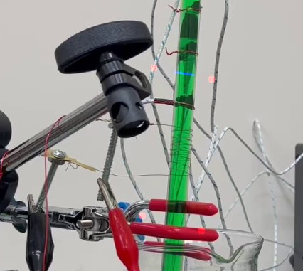

# BubbleDetection

yum bubbles

## Buttons

| key                                 | function               |
| ----------------------------------- | ---------------------- |
| **_for configuration stage_**       |
| enter                               | continue to next step  |
| s                                   | save configuration     |
| z                                   | zoom into image        |
| right click                         | set (scale) positions  |
| left click                          | set bounding rect area |
| **_for image video stuff section_** |
| q                                   | exit                   |

---

## How to use

1. drag and drop video file into console
2. insert the project file name
3. configuration setup
4. image analysis

---

### Sample

- red circles == rectangle
- blue line == scale
